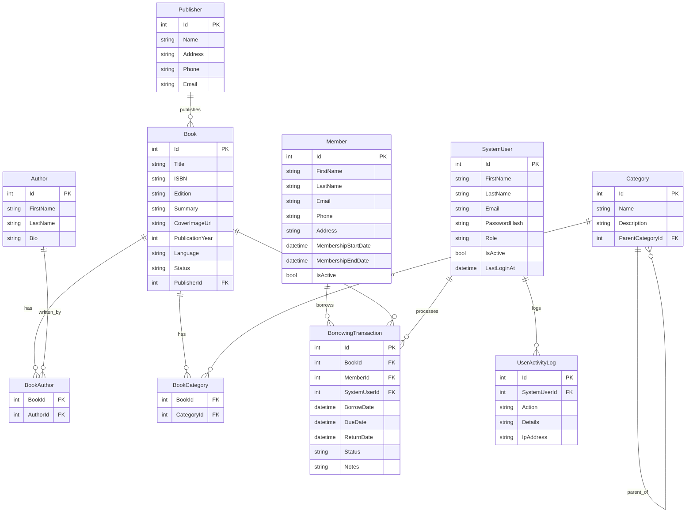

# ERD - Library Management System

```mermaid
erDiagram
  Book {
    int Id PK
    string Title
    string ISBN
    string Edition
    string Summary
    string CoverImageUrl
    int PublicationYear
    string Language
    string Status
    int PublisherId FK
  }
  Author {
    int Id PK
    string FirstName
    string LastName
    string Bio
  }
  Publisher {
    int Id PK
    string Name
    string Address
    string Phone
    string Email
  }
  Category {
    int Id PK
    string Name
    string Description
    int ParentCategoryId FK
  }
  BookAuthor {
    int BookId FK
    int AuthorId FK
  }
  BookCategory {
    int BookId FK
    int CategoryId FK
  }
  Member {
    int Id PK
    string FirstName
    string LastName
    string Email
    string Phone
    string Address
    datetime MembershipStartDate
    datetime MembershipEndDate
    bool IsActive
  }
  SystemUser {
    int Id PK
    string FirstName
    string LastName
    string Email
    string PasswordHash
    string Role
    bool IsActive
    datetime LastLoginAt
  }
  BorrowingTransaction {
    int Id PK
    int BookId FK
    int MemberId FK
    int SystemUserId FK
    datetime BorrowDate
    datetime DueDate
    datetime ReturnDate
    string Status
    string Notes
  }
  UserActivityLog {
    int Id PK
    int SystemUserId FK
    string Action
    string Details
    string IpAddress
  }

  Publisher ||--o{ Book : publishes
  Book ||--o{ BookAuthor : has
  Author ||--o{ BookAuthor : written_by
  Book ||--o{ BookCategory : has
  Category ||--o{ BookCategory : classified_in
  Category ||--o{ Category : parent_of
  Member ||--o{ BorrowingTransaction : borrows
  Book ||--o{ BorrowingTransaction : borrowed_in
  SystemUser ||--o{ BorrowingTransaction : processes
  SystemUser ||--o{ UserActivityLog : logs
```